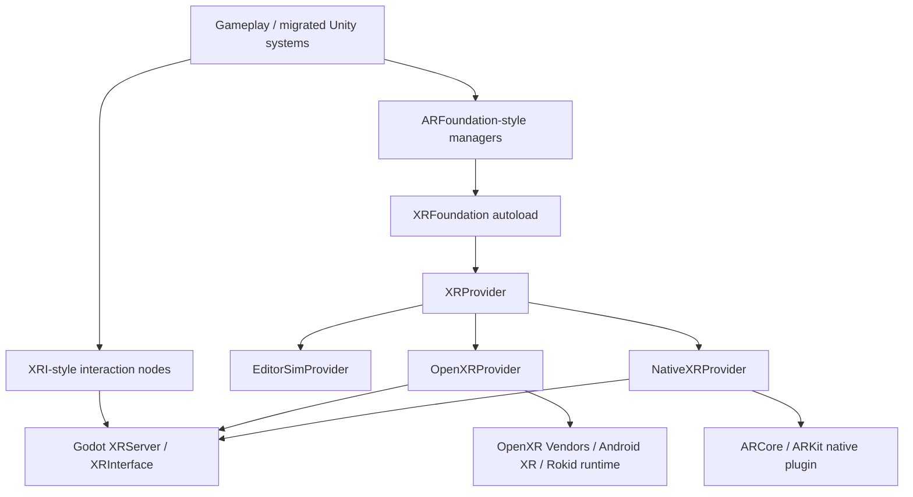

# Architecture



## Boundary Rules

- Gameplay talks to managers and interactables.
- Managers talk to `XRFoundation`.
- `XRFoundation` chooses one provider.
- Providers may talk to native plugins, `XRServer`, or editor simulation.
- No gameplay script should call ARCore, ARKit, or OpenXR vendor APIs directly.
- Platform support must be implemented as a Godot addon, Android plugin, iOS plugin, GDExtension, or OpenXR vendor extension first.
- Engine changes are an escalation path only. If unavoidable, keep them behind the provider boundary and document the exact upstream API gap, touched engine files, and upgrade impact.

## Provider Contract

Every provider implements:

```gdscript
func is_supported() -> bool
func check_availability(options: Dictionary = {}) -> Dictionary
func install(options: Dictionary = {}) -> bool
func start(options: Dictionary = {}) -> bool
func stop() -> void
func get_tracking_status() -> int
func get_tracking_state() -> int
func get_capabilities(options: Dictionary = {}) -> Dictionary
func get_planes() -> Array[ARPlane]
func try_raycast(origin: Vector3, direction: Vector3, max_distance: float, mask: int) -> Array[XRHit]
func create_anchor(transform: Transform3D, attached_trackable: ARTrackable = null) -> ARAnchor
```

This is intentionally smaller than Unity ARFoundation. It is the stable first slice that most AR placement and XRI migration code needs.

## C00 Runtime Contract

The first runnable artifact is `demo/00_device_smoke_test.tscn`.

It must:

- Start the session through the provider layer.
- Display the active backend in-world, so it is visible on Rokid and iPad.
- Print `GXF_SMOKE|{...}` logs with `cycle`, `event`, `backend`, `provider`, `session_state`, `tracking`, `capabilities`, `fps`, and `last_error`.
- Treat `EditorSim` as a development fallback only. Device release gates require `OpenXR` on Rokid and `ARKit` on iPad.

## Godot Upgrade Strategy

This repository must stay upgrade-friendly:

- Runtime gameplay API lives in the addon under `addons/godot_xr_foundation`.
- Native SDK access lives in platform plugins under `android/plugins`, `ios/plugins`, or future GDExtension packages.
- Provider implementations isolate platform quirks, so upgrading Godot should mostly require provider/plugin compatibility work rather than gameplay rewrites.
- Any proposed Godot engine patch must have a plugin/GDExtension alternative analysis before it is accepted.

## Unity Reference Shape

The migration layer follows Unity's split:

- `ARSession` owns lifecycle and availability.
- `XROrigin`/`ARSessionOrigin` maps tracking space into scene space.
- `ARRaycastManager`, `ARPlaneManager`, and `ARAnchorManager` expose feature managers above provider-specific subsystems.
- XRI interaction code stays separate from AR tracking providers.
