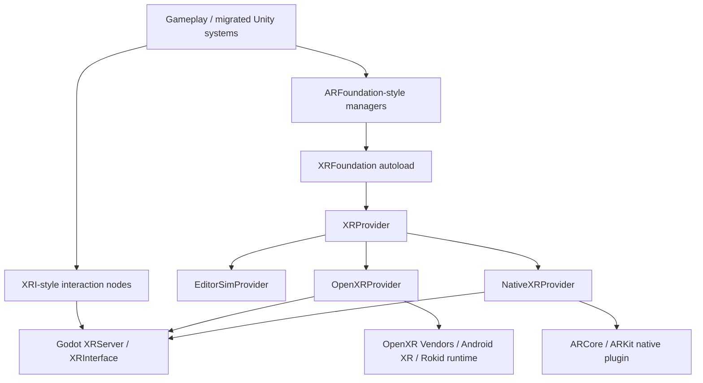

# Architecture



## Boundary Rules

- Gameplay talks to managers and interactables.
- Managers talk to `XRFoundation`.
- `XRFoundation` chooses one provider.
- Providers may talk to native plugins, `XRServer`, or editor simulation.
- No gameplay script should call ARCore, ARKit, or OpenXR vendor APIs directly.

## Provider Contract

Every provider implements:

```gdscript
func is_supported() -> bool
func start(options: Dictionary = {}) -> bool
func stop() -> void
func get_tracking_status() -> int
func get_planes() -> Array[ARPlane]
func try_raycast(origin: Vector3, direction: Vector3, max_distance: float, mask: int) -> Array[XRHit]
func create_anchor(transform: Transform3D, attached_trackable: ARTrackable = null) -> ARAnchor
```

This is intentionally smaller than Unity ARFoundation. It is the stable first slice that most AR placement and XRI migration code needs.

